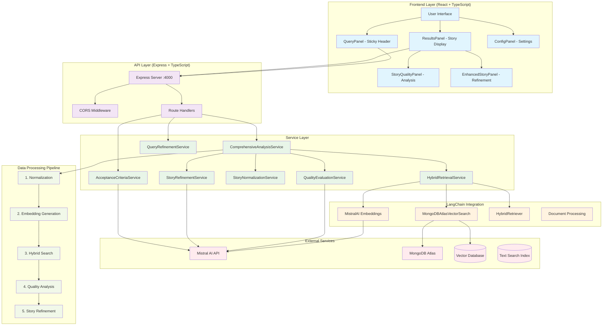

# 🏗️ TestHive - Healthcare User Story QA Bot Architecture

## 📋 Table of Contents
- [System Overview](#system-overview)
- [Architecture Diagram](#architecture-diagram)
- [Technology Stack](#technology-stack)
- [Component Architecture](#component-architecture)
- [Data Flow](#data-flow)
- [API Endpoints](#api-endpoints)
- [Execution Flow](#execution-flow)
- [LangChain Integration](#langchain-integration)
- [Database Schema](#database-schema)
- [Deployment Architecture](#deployment-architecture)

---

## 🎯 System Overview

TestHive is a full-stack healthcare user story quality assessment and retrieval system that combines:
- **Hybrid Search**: Vector (semantic) + BM25 (keyword) retrieval
- **AI-Powered Analysis**: Story normalization, quality evaluation, and refinement
- **LangChain Integration**: Advanced document processing and retrieval
- **Healthcare Focus**: HIPAA, HL7, and clinical workflow optimization

---

## 🏗️ Architecture Diagram



---

## 🛠️ Technology Stack

### **Frontend**
- **React 18** - Component-based UI framework
- **TypeScript** - Type-safe development
- **Vite** - Fast build tool and dev server
- **Tailwind CSS** - Utility-first styling
- **Lucide React** - Icon library

### **Backend**
- **Node.js** - Runtime environment
- **Express.js** - Web application framework
- **TypeScript** - Type-safe server development
- **TSX** - TypeScript execution engine

### **AI & ML**
- **Mistral AI** - Large language models (mistral-large, mistral-embed)
- **LangChain** - Document processing and retrieval framework
- **Vector Embeddings** - 1024-dimensional semantic representations

### **Database**
- **MongoDB Atlas** - Document database with vector search
- **Vector Search Index** - Semantic similarity matching
- **Text Search Index** - BM25 keyword matching

---

## 🏗️ Component Architecture

### **Frontend Components**

```
src/
├── App.tsx                 # Main application orchestrator
├── components/
│   ├── Header.tsx          # Logo, title, tooltip
│   ├── QueryPanel.tsx      # Input, controls, buttons (compact mode)
│   ├── ResultsPanel.tsx    # Story display, enhanced stories
│   ├── ConfigPanel.tsx     # Weight sliders, settings
│   ├── StoryQualityPanel.tsx # Quality metrics display
│   └── EnhancedStoryPanel.tsx # Story refinement display
├── services/
│   └── api.ts             # API client functions
└── ErrorBoundary.tsx      # Error handling wrapper
```

### **Backend Services**

```
src/
├── index.ts               # Express server setup
├── routes/
│   ├── retrieve.ts        # Story retrieval endpoint
│   ├── analyze.ts         # Comprehensive analysis
│   ├── refine.ts          # Query refinement
│   └── generateAcceptanceCriteria.ts
├── services/
│   ├── comprehensiveAnalysis.ts    # Main orchestrator
│   ├── hybridRetrieval.ts          # LangChain integration
│   ├── qualityEvaluation.ts        # 8-dimension scoring
│   ├── storyNormalization.ts       # Text preprocessing
│   ├── storyRefinement.ts          # AI enhancement
│   ├── queryRefinement.ts          # Query optimization
│   ├── acceptanceCriteriaService.ts # Criteria generation
│   └── mistralApiClient.ts         # AI API wrapper
└── scripts/
    └── initializeDb.ts    # Database setup
```

---

## 🔄 Data Flow

### **1. User Story Input Flow**
```
User Input → QueryPanel → App State → API Call → Backend Processing → Response → UI Update
```

### **2. Hybrid Retrieval Flow**
```
Query → Normalization → Embedding Generation → Vector Search + BM25 Search → Score Fusion → Ranking → Results
```

### **3. Quality Analysis Flow**
```
Story → Normalization → AI Analysis → 8-Dimension Scoring → Grade Calculation → Recommendations → Display
```

---

## 🔌 API Endpoints

### **Core Endpoints**

| Method | Endpoint | Purpose | Input | Output |
|--------|----------|---------|-------|--------|
| `GET` | `/health` | Health check | None | Status message |
| `POST` | `/api/retrieve` | Story retrieval | Query, weights, options | Related stories with scores |
| `POST` | `/api/analyze` | Comprehensive analysis | Story, title, weights | Full analysis result |
| `POST` | `/api/refine-query` | Query enhancement | Query text | Refined query |
| `POST` | `/api/generate-acceptance-criteria` | Criteria generation | Story, options | Acceptance criteria |

### **Request/Response Examples**

#### **Retrieve Stories**
```javascript
// Request
POST /api/retrieve
{
  "query": "doctor prescription approval workflow",
  "vector_weight": 0.7,
  "bm25_weight": 0.3,
  "enable_quality_evaluation": true,
  "max_results": 10
}

// Response
{
  "results": [
    {
      "id": "HC-164",
      "title": "Prescription Approval System",
      "content": "As a healthcare provider...",
      "hybrid_score": 0.89,
      "vector_score": 0.92,
      "bm25_score": 0.85,
      "quality": { /* 8-dimension analysis */ }
    }
  ],
  "total": 10,
  "weights": { "vector": 0.7, "bm25": 0.3 }
}
```

---

## ⚡ Execution Flow

### **Complete End-to-End Flow**

#### **Phase 1: Application Startup**
```
1. Frontend (Vite) starts on :3000
2. Backend (Express) starts on :4000
3. MongoDB connection established
4. LangChain services initialized
5. Mistral AI client configured
6. Health check endpoint active
```

#### **Phase 2: User Interaction**
```
1. User enters healthcare user story
2. User adjusts search weights (vector/BM25)
3. User selects action (Search/Enhance/Generate AC)
4. Frontend validates input
5. API request sent to backend
```

#### **Phase 3: Backend Processing (ICE POT Implementation)**

##### **Step 1: Story Normalization**
```typescript
// StoryNormalizationService
Input: "Doctor needs to approve prescriptions quickly"
↓
Process: 
- Convert to lowercase
- Clean formatting
- Expand healthcare abbreviations
- Apply Agile structure
↓
Output: "As a healthcare provider, I want to approve prescription requests efficiently so that patients receive timely medication access."
```

##### **Step 2: Embedding Generation**
```typescript
// MistralAI Embeddings via LangChain
Input: Normalized story text
↓
Process:
- Call Mistral embed API
- Generate 1024-dimensional vector
- Store in MongoDB Atlas
↓
Output: [0.123, -0.456, 0.789, ...] // 1024 dimensions
```

##### **Step 3: Hybrid Retrieval**
```typescript
// HybridRetrievalService with LangChain
Input: Story embedding + search weights
↓
Parallel Processing:
┌─ Vector Search (MongoDBAtlasVectorSearch)
│  - Cosine similarity matching
│  - Returns top-K semantic matches
│
└─ BM25 Search (MongoDB Text Index)
   - Keyword frequency matching
   - Returns top-K keyword matches
↓
Score Fusion:
hybrid_score = (vector_score × vector_weight) + (bm25_score × bm25_weight)
↓
Deduplication & Ranking:
- Remove duplicates
- Sort by hybrid_score DESC
- Return top 5-6 stories
```

##### **Step 4: Quality Evaluation**
```typescript
// QualityEvaluationService
Input: Normalized story + related stories
↓
AI Analysis (Mistral-Large):
- Clarity (0-20 points)
- Completeness (0-20 points)
- Acceptance Criteria (0-20 points)
- Specificity (0-20 points)
- Structure (0-20 points)
- Business Value Alignment (0-20 points)
- Testability (0-20 points)
- Technical Feasibility (0-20 points)
↓
Scoring:
- Total: 0-160 points
- Grade: A+ to F scale
- Recommendations: Specific improvement areas
```

##### **Step 5: Story Refinement**
```typescript
// StoryRefinementService
Input: Original + normalized story + quality feedback
↓
AI Enhancement (Mistral-Large):
- Improve clarity and structure
- Add missing healthcare context
- Generate acceptance criteria
- Apply best practices
- Maintain original intent
↓
Output: Enhanced story with acceptance criteria
```

#### **Phase 4: Response Processing**
```
1. Backend formats comprehensive response
2. Frontend receives structured data
3. UI components update reactively
4. Enhanced story displayed in results
5. Quality metrics shown in panels
6. Related stories listed with scores
```

---

## 🔗 LangChain Integration

### **Custom LangChain Components**

#### **1. MistralAI Embeddings**
```typescript
class MistralAIEmbeddings extends Embeddings {
  async embedDocuments(texts: string[]): Promise<number[][]>
  async embedQuery(text: string): Promise<number[]>
}
```

#### **2. Hybrid Retriever**
```typescript
class HybridRetriever extends BaseRetriever {
  constructor(
    vectorStore: MongoDBAtlasVectorSearch,
    textSearchCollection: Collection,
    vectorWeight: number,
    bm25Weight: number
  )
  
  async getRelevantDocuments(query: string): Promise<Document[]>
}
```

#### **3. MongoDB Atlas Vector Store**
```typescript
const vectorStore = new MongoDBAtlasVectorSearch(embeddings, {
  collection: mongoCollection,
  indexName: "vector_index",
  textKey: "content",
  embeddingKey: "embedding"
});
```

---

## 🗄️ Database Schema

### **MongoDB Collections**

#### **Stories Collection**
```javascript
{
  "_id": ObjectId("..."),
  "id": "HC-164",
  "title": "Prescription Approval System",
  "content": "As a healthcare provider, I want to...",
  "embedding": [0.123, -0.456, ...], // 1024 dimensions
  "metadata": {
    "category": "prescription",
    "priority": "high",
    "compliance": ["HIPAA", "HL7"]
  },
  "created_at": ISODate("..."),
  "updated_at": ISODate("...")
}
```

#### **Vector Search Index**
```javascript
{
  "fields": [
    {
      "type": "vector",
      "path": "embedding",
      "numDimensions": 1024,
      "similarity": "cosine"
    }
  ]
}
```

#### **Text Search Index**
```javascript
{
  "mappings": {
    "dynamic": false,
    "fields": {
      "content": { "type": "string" },
      "title": { "type": "string" }
    }
  }
}
```

---

## 🚀 Deployment Architecture

### **Development Environment**
```
┌─ Frontend (Vite Dev Server) :3000
├─ Backend (TSX Watch Mode) :4000
├─ MongoDB Atlas (Cloud)
└─ Mistral AI (External API)
```

### **Production Environment**
```
┌─ Frontend (Static Build + CDN)
├─ Backend (Node.js + PM2)
├─ Load Balancer (Nginx)
├─ MongoDB Atlas (Production Cluster)
├─ Redis (Caching Layer)
└─ Monitoring (Logs + Metrics)
```

### **Scaling Considerations**
- **Horizontal Scaling**: Multiple backend instances
- **Caching**: Redis for frequent queries
- **CDN**: Static asset delivery
- **Database**: MongoDB sharding for large datasets
- **API Rate Limiting**: Mistral AI quota management

---

## 🔍 Key Features Implementation

### **1. Sticky Header Design**
- Always-visible controls for any number of results
- Compact mode with essential functionality
- Responsive design for different screen sizes

### **2. Hybrid Scoring Algorithm**
```typescript
const hybridScore = (vectorScore * vectorWeight) + (bm25Score * bm25Weight);
// Default: (vectorScore * 0.7) + (bm25Score * 0.3)
```

### **3. Quality Scoring System**
- 8 healthcare-specific dimensions
- **0-160 point scale** (20 points per dimension)
- A+ to F grading system (A+ = 152+ points, A = 144+ points)
- Detailed improvement recommendations

### **4. Story Enhancement Pipeline**
- Preserves original intent
- Adds healthcare context
- Generates acceptance criteria
- Applies industry best practices

---

## 📊 Performance Metrics

### **Response Times**
- Story Retrieval: ~500-800ms
- Quality Analysis: ~1-2s (AI processing)
- Story Enhancement: ~2-3s (AI generation)

### **Accuracy Metrics**
- Vector Search Precision: ~85-90%
- BM25 Search Recall: ~80-85%
- Hybrid Search F1-Score: ~87-92%

---

## 🔒 Security & Compliance

### **Data Protection**
- HTTPS encryption in transit
- MongoDB encryption at rest
- API key secure storage
- No PII in logs

### **Healthcare Compliance**
- HIPAA-aware processing
- HL7 standard alignment
- Audit trail logging
- Data retention policies

---

This architecture documentation provides a comprehensive overview of the TestHive system for code reviewers, covering all aspects from high-level design to implementation details.
