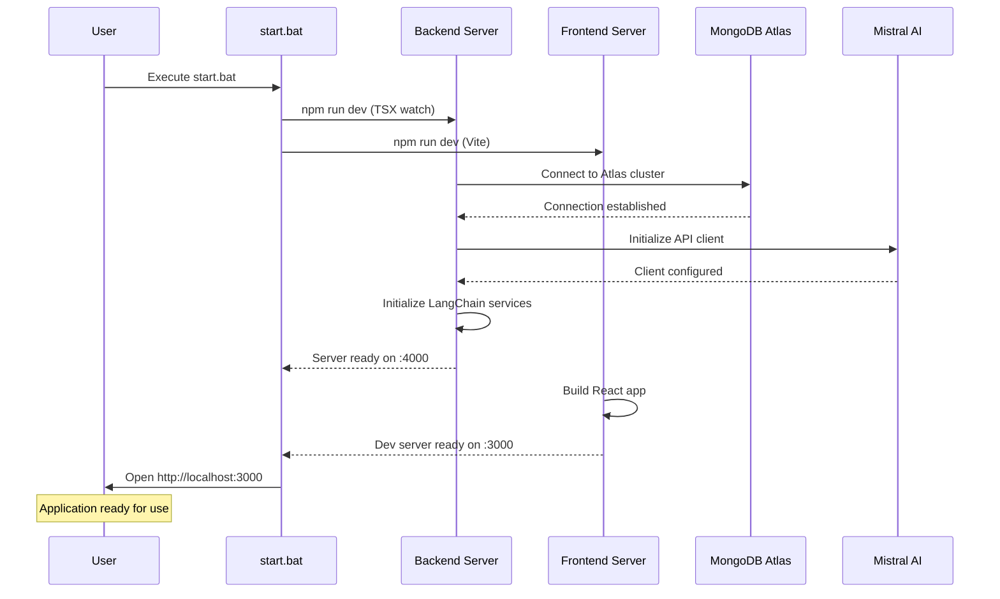
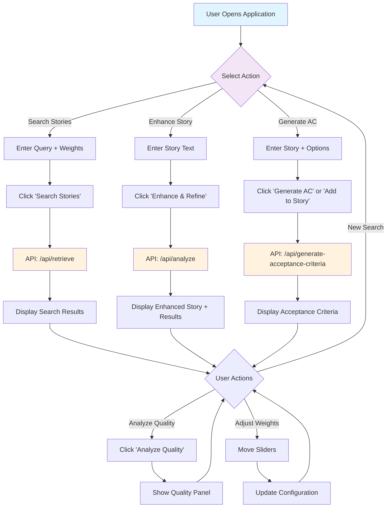
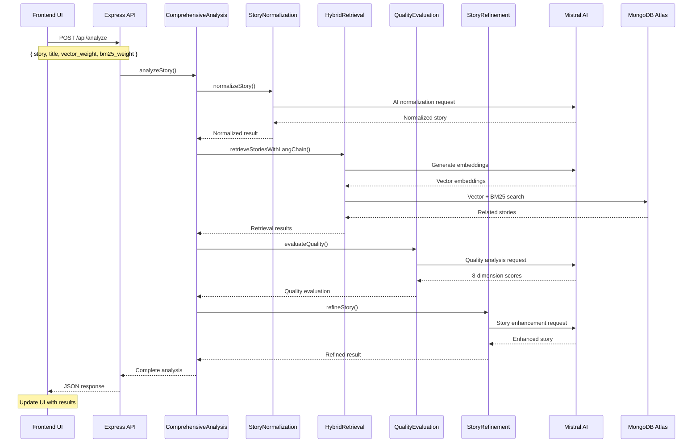
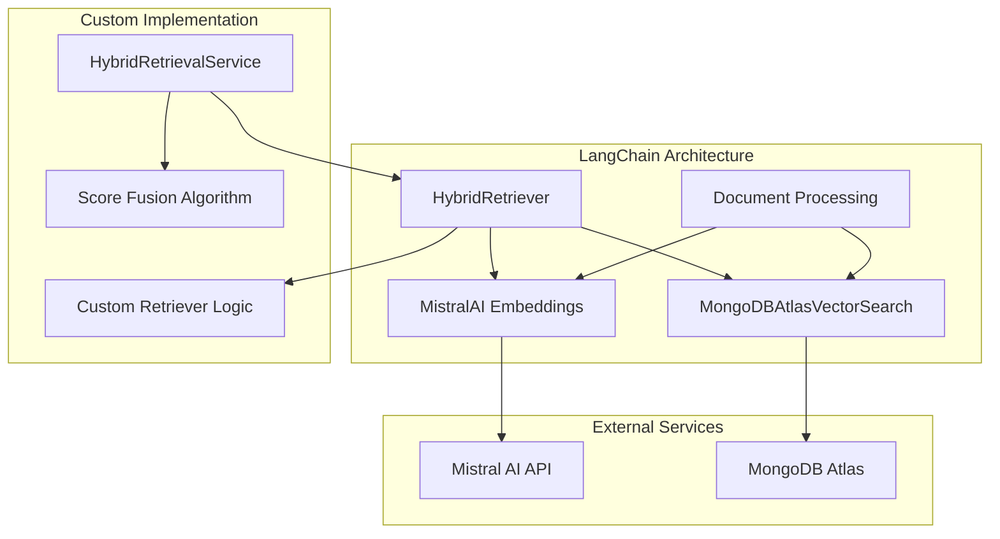
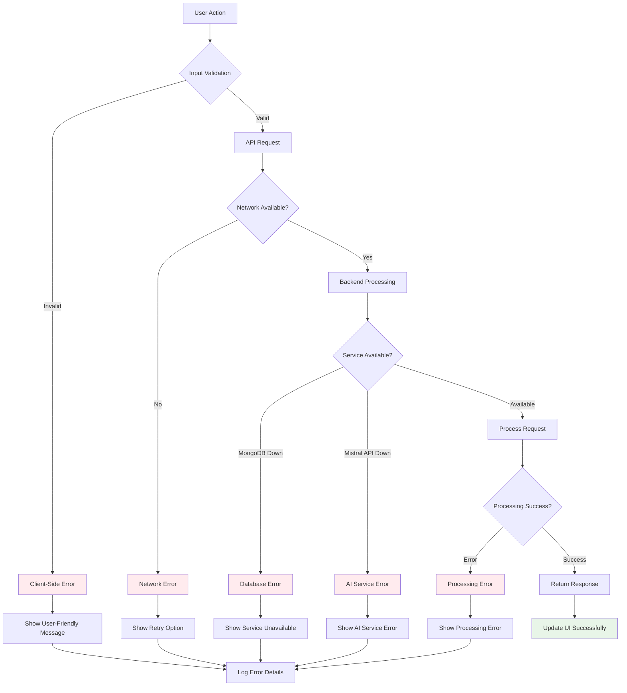

# 🔄 TestHive - Execution Flow & Internal Workings

## 📋 Quick Navigation
- [System Startup Flow](#system-startup-flow)
- [User Interaction Flow](#user-interaction-flow)
- [Core Processing Pipeline](#core-processing-pipeline)
- [API Request Flow](#api-request-flow)
- [LangChain Integration Flow](#langchain-integration-flow)
- [Error Handling Flow](#error-handling-flow)

---

## 🚀 System Startup Flow

### **1. Application Launch Sequence**



### **2. Service Initialization Details**

```typescript
// Backend Startup (src/index.ts)
1. Load environment variables (.env)
2. Initialize Express app with middleware
3. Setup CORS for frontend communication
4. Connect to MongoDB Atlas
5. Initialize Mistral AI client
6. Setup LangChain components:
   - MistralAI Embeddings
   - MongoDBAtlasVectorSearch
   - HybridRetriever
7. Register API routes
8. Start server on port 4000
9. Health check endpoint active

// Frontend Startup (src/main.tsx)
1. Load Vite configuration
2. Initialize React app
3. Setup error boundary
4. Mount App component
5. Start dev server on port 3000
6. Hot reload enabled
```

---

## 👤 User Interaction Flow

### **Complete User Journey**



---

## ⚙️ Core Processing Pipeline

### **The 5-Step ICE POT Analysis**

```mermaid
graph LR
    subgraph "Input Processing"
        INPUT[User Story Input]
        VALIDATE[Input Validation]
    end
    
    subgraph "Step 1: Normalization"
        NORM[Story Normalization]
        CLEAN[Text Cleaning]
        STRUCT[Structure Enhancement]
    end
    
    subgraph "Step 2: Embedding"
        EMB_GEN[Generate Embeddings]
        MISTRAL_EMB[Mistral AI Embed]
        VECTOR[1024D Vector]
    end
    
    subgraph "Step 3: Retrieval"
        HYBRID[Hybrid Search]
        VEC_SEARCH[Vector Search]
        BM25_SEARCH[BM25 Search]
        FUSION[Score Fusion]
    end
    
    subgraph "Step 4: Quality"
        QUAL_EVAL[Quality Evaluation]
        EIGHT_DIM[8-Dimension Analysis]
        SCORING[Score Calculation]
    end
    
    subgraph "Step 5: Refinement"
        REFINE[Story Refinement]
        AI_ENHANCE[AI Enhancement]
        AC_GEN[Acceptance Criteria]
    end
    
    INPUT --> VALIDATE
    VALIDATE --> NORM
    NORM --> CLEAN
    CLEAN --> STRUCT
    
    STRUCT --> EMB_GEN
    EMB_GEN --> MISTRAL_EMB
    MISTRAL_EMB --> VECTOR
    
    VECTOR --> HYBRID
    HYBRID --> VEC_SEARCH
    HYBRID --> BM25_SEARCH
    VEC_SEARCH --> FUSION
    BM25_SEARCH --> FUSION
    
    FUSION --> QUAL_EVAL
    QUAL_EVAL --> EIGHT_DIM
    EIGHT_DIM --> SCORING
    
    SCORING --> REFINE
    REFINE --> AI_ENHANCE
    AI_ENHANCE --> AC_GEN
    
    style INPUT fill:#e3f2fd
    style NORM fill:#e8f5e8
    style EMB_GEN fill:#fff3e0
    style HYBRID fill:#f3e5f5
    style QUAL_EVAL fill:#fce4ec
    style REFINE fill:#e0f2f1
```



### **Detailed Step Breakdown**

#### **Step 1: Story Normalization**
```typescript
// Input: Raw user story
"Doctor needs to approve prescriptions quickly"

// Process (StoryNormalizationService)
1. Convert to lowercase
2. Remove special characters
3. Expand healthcare abbreviations (Rx → prescription)
4. Apply Agile user story template
5. Add healthcare context

// Output: Normalized story
"As a healthcare provider, I want to approve prescription requests efficiently so that patients receive timely medication access."
```

#### **Step 2: Embedding Generation**
```typescript
// Process (MistralAI Embeddings via LangChain)
const embeddings = new MistralAIEmbeddings({
  apiKey: process.env.MISTRAL_API_KEY,
  model: "mistral-embed"
});

const vector = await embeddings.embedQuery(normalizedStory);
// Returns: Float32Array[1024] - semantic representation
```

#### **Step 3: Hybrid Retrieval**
```typescript
// Parallel Processing
const vectorResults = await vectorStore.similaritySearch(query, k);
const bm25Results = await textSearchCollection.find({
  $text: { $search: query }
}).toArray();

// Score Fusion
const hybridScore = (vectorScore * vectorWeight) + (bm25Score * bm25Weight);
// Default: (vectorScore * 0.7) + (bm25Score * 0.3)
```

#### **Step 4: Quality Evaluation**
```typescript
// 8-Dimension Healthcare Analysis
const dimensions = [
  'clarity',           // 0-20 points
  'completeness',      // 0-20 points
  'acceptanceCriteria', // 0-20 points
  'specificity',       // 0-20 points
  'structure',         // 0-20 points
  'businessValueAlignment', // 0-20 points
  'testability',       // 0-20 points
  'technicalFeasibility' // 0-20 points
];

// Total: 0-160 points → Grade A+ to F (A+ = 152+ points)
```

#### **Step 5: Story Refinement**
```typescript
// AI Enhancement Process
1. Analyze original vs normalized story
2. Identify improvement areas from quality evaluation
3. Generate enhanced version with Mistral-Large
4. Add acceptance criteria (Given/When/Then format)
5. Maintain original business intent
6. Apply healthcare best practices
```

---

## 🔌 API Request Flow

### **Comprehensive Analysis Endpoint**



### **Request/Response Structure**

#### **Request Format**
```typescript
interface AnalyzeRequest {
  story: string;           // User story text
  title?: string;          // Optional title
  vector_weight: number;   // 0.0 - 1.0 (default: 0.7)
  bm25_weight: number;     // 0.0 - 1.0 (default: 0.3)
}
```

#### **Response Format**
```typescript
interface AnalyzeResponse {
  originalStory: string;
  normalizedStory: string;
  refinedStory: {
    story: string;
    acceptanceCriteria: string[];
  };
  relatedStories: Array<{
    id: string;
    title: string;
    content: string;
    hybrid_score: number;
    vector_score: number;
    bm25_score: number;
  }>;
  overallScore: {
    score: string;    // "8.5"
    grade: string;    // "A-"
  };
  qualityMetrics: {
    clarity: QualityDimension;
    completeness: QualityDimension;
    // ... 6 more dimensions
  };
  improvementAreas: string[];
  recommendations: string[];
}
```

---

## 🔗 LangChain Integration Flow

### **Custom LangChain Components**



### **LangChain Component Details**

#### **1. Custom MistralAI Embeddings**
```typescript
class MistralAIEmbeddings extends Embeddings {
  constructor(fields: {
    apiKey: string;
    model: string;
    maxRetries: number;
  }) {
    super(fields);
  }

  async embedDocuments(texts: string[]): Promise<number[][]> {
    // Batch embedding generation
    const response = await this.mistralClient.embeddings({
      model: this.model,
      input: texts
    });
    return response.data.map(item => item.embedding);
  }

  async embedQuery(text: string): Promise<number[]> {
    // Single query embedding
    const response = await this.mistralClient.embeddings({
      model: this.model,
      input: [text]
    });
    return response.data[0].embedding;
  }
}
```

#### **2. Hybrid Retriever Implementation**
```typescript
class HybridRetriever extends BaseRetriever {
  constructor(
    private vectorStore: MongoDBAtlasVectorSearch,
    private textSearchCollection: Collection,
    private vectorWeight: number = 0.7,
    private bm25Weight: number = 0.3
  ) {
    super();
  }

  async getRelevantDocuments(query: string): Promise<Document[]> {
    // Parallel execution
    const [vectorResults, bm25Results] = await Promise.all([
      this.vectorStore.similaritySearch(query, 10),
      this.performBM25Search(query)
    ]);

    // Score fusion and deduplication
    return this.fuseResults(vectorResults, bm25Results);
  }

  private fuseResults(
    vectorResults: Document[],
    bm25Results: Document[]
  ): Document[] {
    const scoreMap = new Map<string, number>();
    
    // Calculate hybrid scores
    vectorResults.forEach((doc, index) => {
      const vectorScore = 1 - (index / vectorResults.length);
      const existingScore = scoreMap.get(doc.id) || 0;
      scoreMap.set(doc.id, existingScore + (vectorScore * this.vectorWeight));
    });

    bm25Results.forEach((doc, index) => {
      const bm25Score = 1 - (index / bm25Results.length);
      const existingScore = scoreMap.get(doc.id) || 0;
      scoreMap.set(doc.id, existingScore + (bm25Score * this.bm25Weight));
    });

    // Sort by hybrid score and return top results
    return Array.from(scoreMap.entries())
      .sort((a, b) => b[1] - a[1])
      .slice(0, 6)
      .map(([id, score]) => ({ id, score, ...getDocumentById(id) }));
  }
}
```

---

## 🚨 Error Handling Flow

### **Comprehensive Error Management**



### **Error Handling Implementation**

#### **Frontend Error Boundary**
```typescript
class ErrorBoundary extends Component {
  state = { hasError: false, error: null };

  static getDerivedStateFromError(error: Error) {
    return { hasError: true, error };
  }

  componentDidCatch(error: Error, errorInfo: ErrorInfo) {
    console.error('Application Error:', error, errorInfo);
    // Log to monitoring service
  }

  render() {
    if (this.state.hasError) {
      return <ErrorFallback error={this.state.error} />;
    }
    return this.props.children;
  }
}
```

#### **API Error Handling**
```typescript
// Backend error middleware
app.use((error: Error, req: Request, res: Response, next: NextFunction) => {
  console.error('API Error:', error);
  
  if (error instanceof ValidationError) {
    return res.status(400).json({ message: error.message });
  }
  
  if (error instanceof DatabaseError) {
    return res.status(503).json({ message: 'Service temporarily unavailable' });
  }
  
  if (error instanceof AIServiceError) {
    return res.status(502).json({ message: 'AI service unavailable' });
  }
  
  res.status(500).json({ message: 'Internal server error' });
});

// Frontend API client with retry logic
const apiClient = {
  async request(endpoint: string, options: RequestOptions) {
    let retries = 3;
    while (retries > 0) {
      try {
        const response = await fetch(endpoint, options);
        if (!response.ok) throw new Error(`HTTP ${response.status}`);
        return response.json();
      } catch (error) {
        retries--;
        if (retries === 0) throw error;
        await new Promise(resolve => setTimeout(resolve, 1000));
      }
    }
  }
};
```

---

## 📊 Performance Monitoring

### **Key Metrics Tracked**

```typescript
interface PerformanceMetrics {
  // Response Times
  apiResponseTime: number;        // Average API response time
  embeddingGenerationTime: number; // Mistral AI embedding time
  vectorSearchTime: number;       // MongoDB vector search time
  bm25SearchTime: number;         // MongoDB text search time
  qualityAnalysisTime: number;    // AI quality evaluation time
  
  // Accuracy Metrics
  vectorSearchPrecision: number;  // Semantic search accuracy
  bm25SearchRecall: number;       // Keyword search coverage
  hybridSearchF1Score: number;    // Combined search effectiveness
  
  // System Health
  memoryUsage: number;           // Node.js memory consumption
  cpuUsage: number;              // Server CPU utilization
  databaseConnections: number;    // Active MongoDB connections
  apiRateLimit: number;          // Mistral AI quota usage
}
```

### **Monitoring Implementation**
```typescript
// Performance tracking middleware
app.use((req, res, next) => {
  const startTime = Date.now();
  
  res.on('finish', () => {
    const duration = Date.now() - startTime;
    console.log(`${req.method} ${req.path} - ${duration}ms`);
    
    // Log to monitoring service
    metrics.recordApiCall(req.path, duration, res.statusCode);
  });
  
  next();
});
```

---

This execution flow documentation provides reviewers with a complete understanding of how the TestHive system operates internally, from startup to complex AI-powered analysis workflows.
